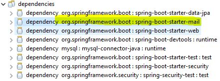
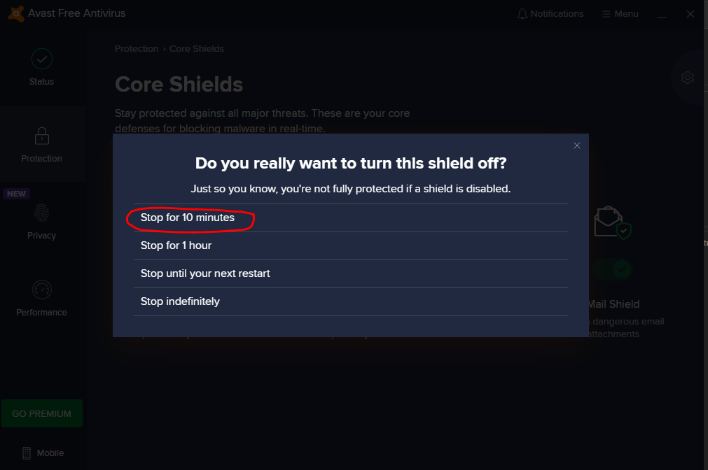

# FormLogin with email-verification

## Dependencies

* In this exapmle I used the following security configuration:
1. Form Login
2. Failure Handler 
3. Disabled CSRF (Because this exapmle is only to show the Email Verification)
	This way no need to Worry about POST , PUT DELETE methods , because CSRF is disabled
4. In AppViewController , I used the Object of [RedirectView](#-), which I redirect to different Url, if Registration fails
	

# Define SMTP server
In order to work with google's SMTP server I had to do the following : https://support.google.com/accounts/answer/185833
- define my email account with 2 step verification

# Running the App
* When running the App , I had to disable AVAST security since it blocks as firewall
* Thus I Had to do the follwoing to Disable the MailShield , in this exapmle picture shows 10 min:
<table>
  <tr>
     <td>Select :Protection -> Core Shields</td>
     <td>Select: Mail shield</td>
     <td>Select time for example 10min</td>
  </tr>
  <tr>
    <td></td>
    <td></td>
    <td></td>
  </tr>
 </table>
