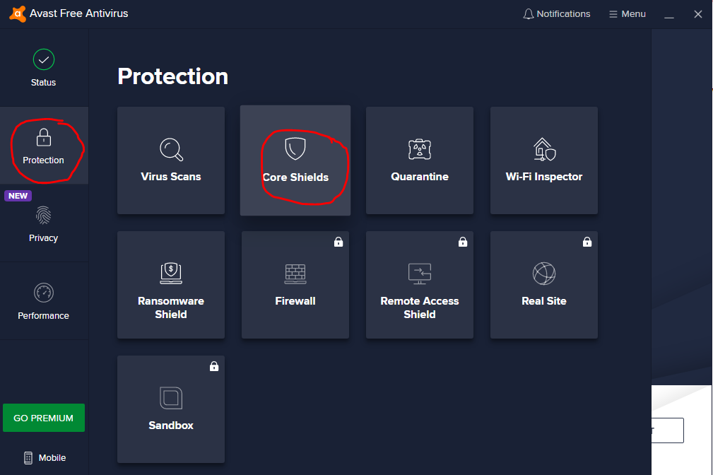
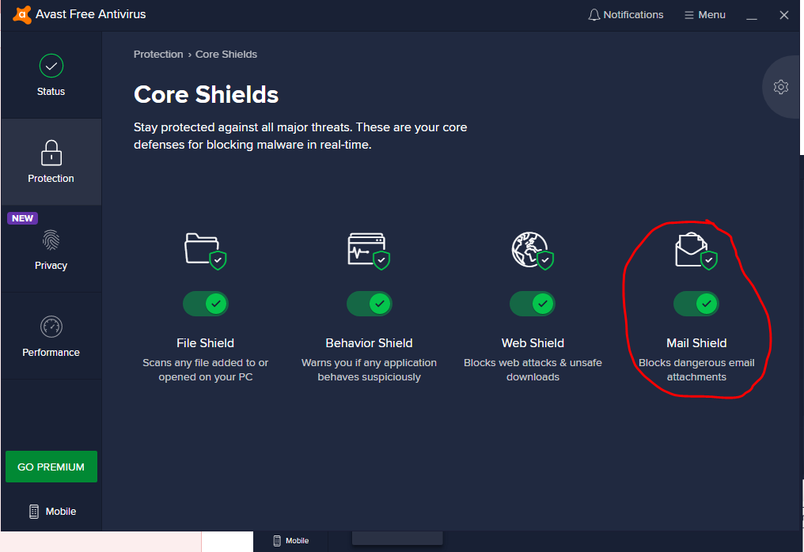

# FormLogin with email-verification
* Images issue troubleshoot

## Dependencies


* In this exapmle I used the following security configuration:
1. Form Login
2. Failure Handler 
3. Disabled CSRF (Because this exapmle is only to show the Email Verification)
	This way no need to Worry about POST , PUT DELETE methods , because CSRF is disabled
4. In AppViewCOntroller , I used the Object of RedirectView, which I redirect to different Url, if Registration fails
	

# Define SMTP server
In order to work with google's SMTP server I had to do the following : https://support.google.com/accounts/answer/185833
- define my email account with 2 step verification

# Running the App
* When running the App , I had to disable AVAST security since it blocks as firewall
* Thus I Had to do the follwoing to Disable the MailShield , in this exapmle picture shows 10 min:
<table>
  <tr>
     <td>Select :Protection -> Core Shields</td>
     <td>Select: Mail shield</td>
     <td>Select time for example 10min</td>
  </tr>
  <tr>
    <td></td>
    <td></td>
    <td></td>
  </tr>
 </table>

# link example
1. [israel hayom](https://www.israelhayom.co.il/)
2. [hidavroot](https://www.hidabroot.org/)

# List example
1. item one
2. item two
3. item three

# Blockquotes :
> Dorothy followed her through many of the beautiful rooms in her castle.


### Blockquotes with Other Elements  :
> ### The quarterly results look great!
>
> - Revenue was off the chart.
> - Profits were higher than ever.
>
>  *Everything* is going according to **plan**.

### Blockquotes another example:
*   This is the first list item.
*   Here's the second list item.

    > A blockquote would look great below the second list item.

*   And here's the third list item.


# Code Blocks
To create code blocks, indent every line of the block by at least four spaces or one tab.

    <html>
      <head>
      </head>
    </html>

### Code Blocks
Code blocks are normally indented four spaces or one tab. When they’re in a list, indent them eight spaces or two tabs.

1.  Open the file.
2.  Find the following code block on line 21:

        <html>
          <head>
            <title>Test</title>
          </head>
		  

```
code fences
```

```js
codeFences.withLanguage()
```

# checkbox

- [ ] Checkbox off
- [x] Checkbox on

# Add Inline HTML

<dl>
  <dt>Definition list</dt>
  <dd>Is something people use sometimes.</dd>

  <dt>Markdown in HTML</dt>
  <dd>Does *not* work **very** well. Use HTML <em>tags</em>.</dd>
</dl>

# Add Tables
Colons can be used to align columns.

| Tables        | Are           | Cool  |
| ------------- |:-------------:| -----:|
| col 3 is      | right-aligned | $1600 |
| col 2 is      | centered      |   $12 |
| zebra stripes | are neat      |    $1 |

There must be at least 3 dashes separating each header cell.
The outer pipes (|) are optional, and you don't need to make the 
raw Markdown line up prettily. You can also use inline Markdown.

Markdown | Less | Pretty
--- | --- | ---
*Still* | `renders` | **nicely**
1 | 2 | 3

# Add image from local repsoitory


# Add Image as url

